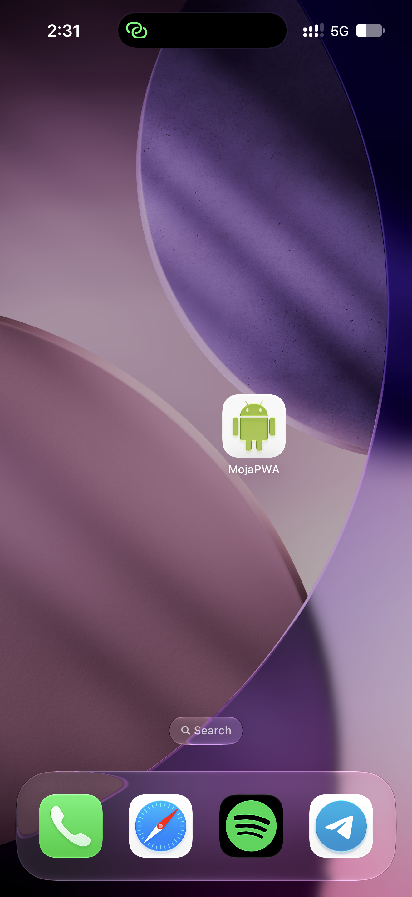
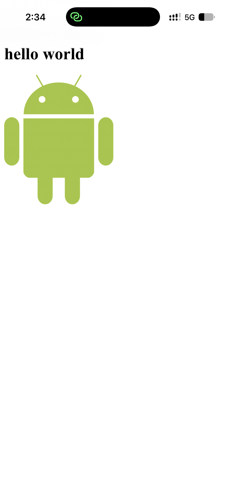

# Lab 1 — PWA podstawy

Aplikacja: https://ar1mi.github.io/ZTAM/lab_01/

Zrzuty ekranu zainstalowanej aplikacji na telefonie (iPhone, Safari → Do ekranu początkowego):

| Ikona na ekranie głównym | Uruchomiona aplikacja |
| --- | --- |
|  |  |
